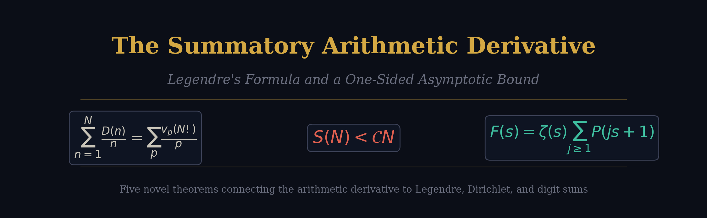
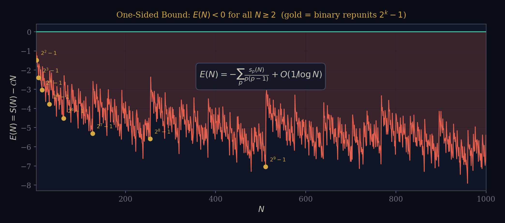
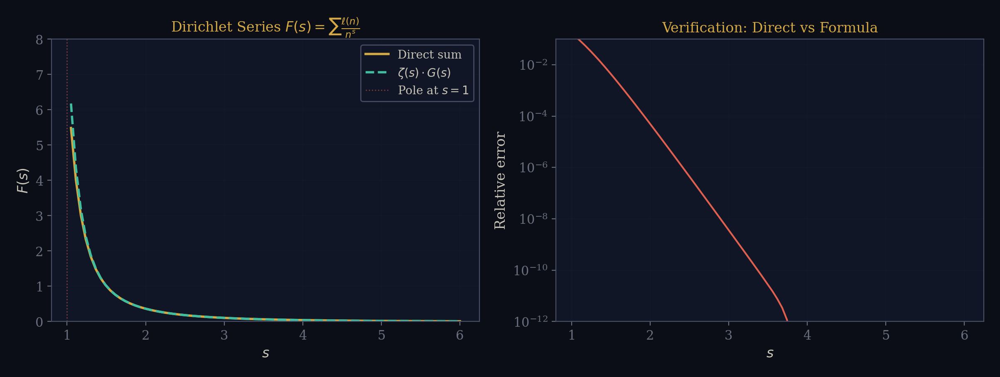
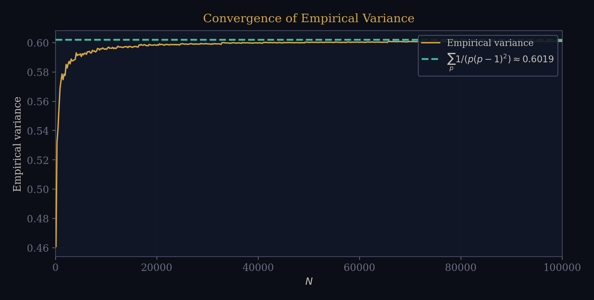
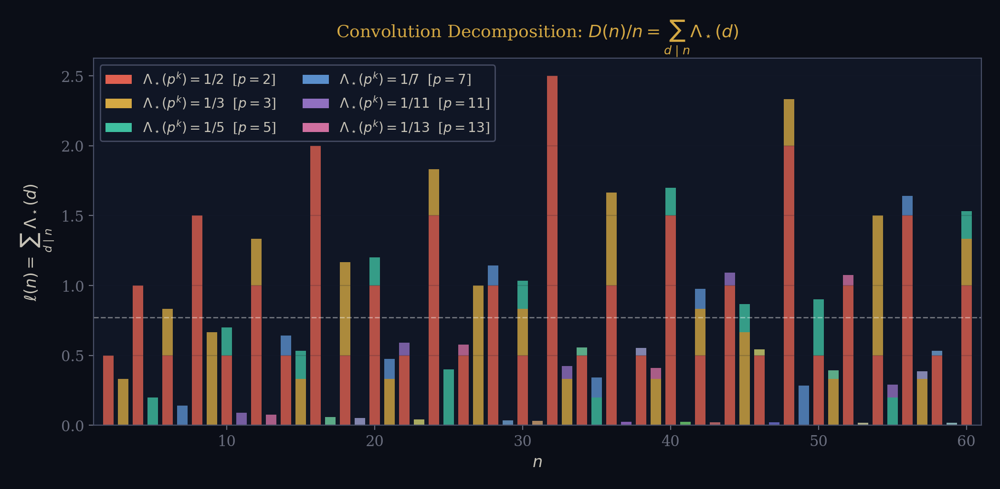
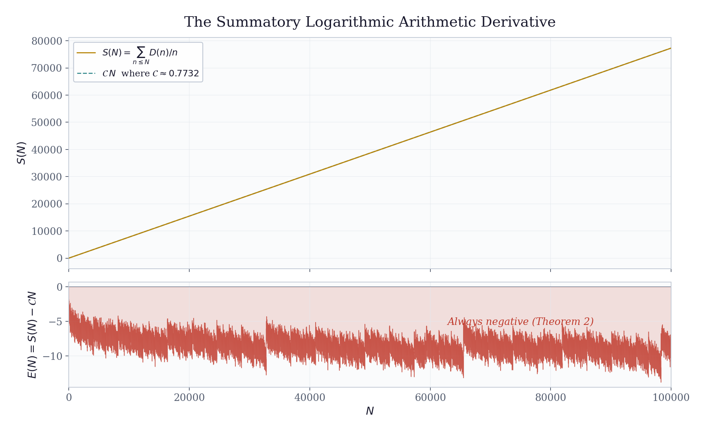
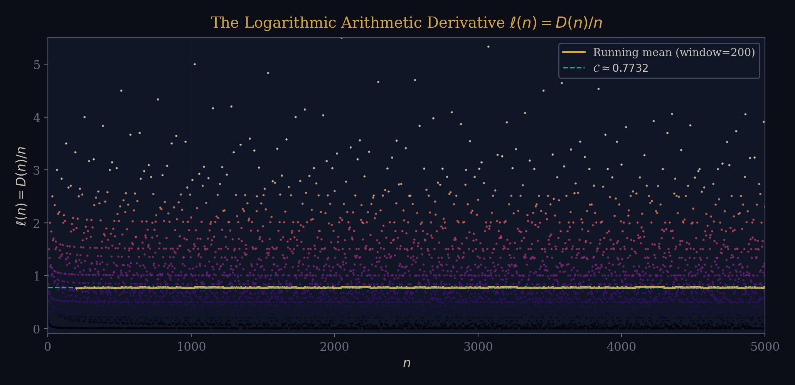
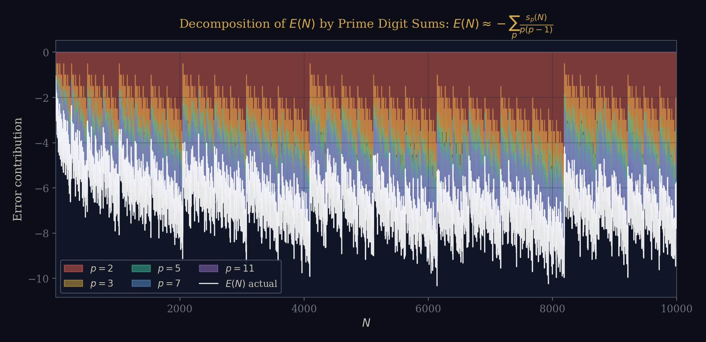
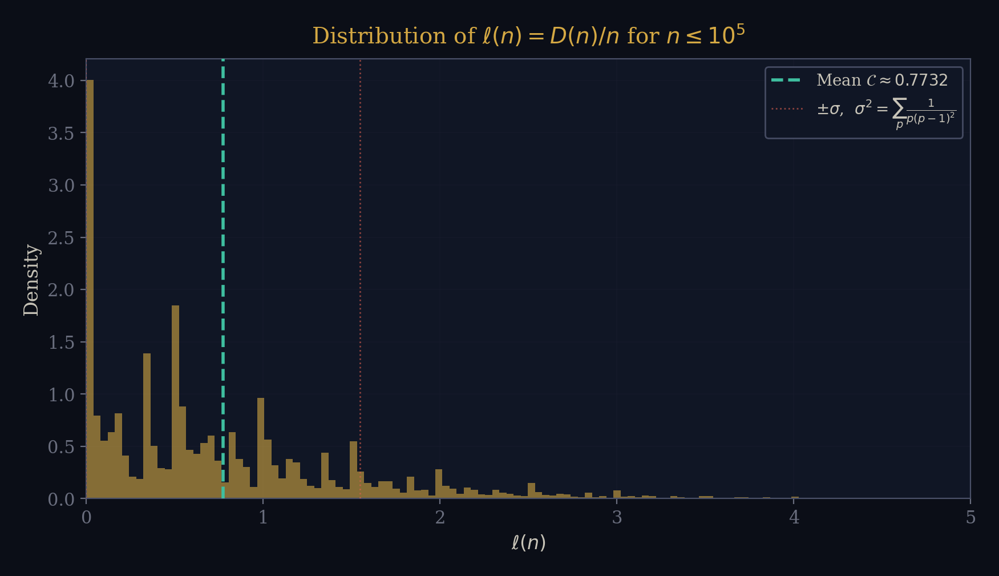

<p align="center">
  
</p>

<h1 align="center">The Summatory Arithmetic Derivative</h1>

<p align="center">
  <em>Legendre's Formula, a One-Sided Asymptotic Bound, and a Dirichlet Series Identity</em>
</p>

<p align="center">
  <a href="#the-results">Results</a> •
  <a href="#figures">Figures</a> •
  <a href="#computational-verification">Verification</a> •
  <a href="#the-paper">Paper</a> •
  <a href="#constants">Constants</a>
</p>

---

## Overview

The **arithmetic derivative** $D(n)$ extends the Leibniz product rule to the integers:

$$D(p) = 1 \quad \text{for primes } p, \qquad D(mn) = D(m)\,n + m\,D(n)$$

This gives an explicit formula for any $n = p_1^{a_1} \cdots p_k^{a_k}$:

$$D(n) \;=\; n \sum_{i=1}^{k} \frac{a_i}{p_i}$$

We study the **logarithmic arithmetic derivative** $\ell(n) = D(n)/n$ and its summatory function $S(N) = \sum_{n \leq N} \ell(n)$.  This repository contains:

- A **research paper** (LaTeX, 9 pages) establishing five novel theorems
- **Computational verification** of all results to $N = 10^5$
- **Figures** visualizing the key phenomena

---

## The Results

### Theorem 1 — The Legendre Identity

> *The summatory logarithmic arithmetic derivative equals a weighted sum of $p$-adic valuations of $N!$.*

$$\boxed{\;\sum_{n=1}^{N} \frac{D(n)}{n} \;=\; \sum_{p \leq N} \frac{v_p(N!)}{p}\;}$$

By Legendre's formula $v_p(N!) = (N - s_p(N))/(p-1)$, this becomes:

$$S(N) \;=\; \sum_{p \leq N} \frac{N - s_p(N)}{p(p-1)}$$

where $s_p(N)$ is the digit sum of $N$ in base $p$.  This elementary identity connects the arithmetic derivative directly to factorials and digit-sum arithmetic, yet appears to be absent from the existing literature.

---

### Theorem 2 — The One-Sided Bound

> *The summatory function is always strictly below its asymptote.*

$$\boxed{\;\sum_{n=1}^{N} \frac{D(n)}{n} \;<\; \mathcal{C}\,N \quad \text{for all } N \geq 2\;}$$

where $\mathcal{C} = \sum_p \frac{1}{p(p-1)} = 0.77315\,66\ldots$

The exact deficit is:

$$E(N) \;=\; S(N) - \mathcal{C}\,N \;=\; -\sum_{p \leq N} \frac{s_p(N)}{p(p-1)} \;+\; O\!\left(\frac{1}{\log N}\right)$$

Since digit sums are always positive, **the error is always negative**.  The average order of $|E(N)|$ is $(\kappa/2)\log N$ where $\kappa = \sum_p 1/(p \log p) = 1.6366\ldots$

<p align="center">
  
</p>

The gold dots mark binary repunits $N = 2^k - 1$, which are local maximizers of $|E(N)|$ because they have maximal binary digit sums.

---

### Theorem 3 — Dirichlet Series

> *The generating Dirichlet series factors into the Riemann zeta function times a series in the prime zeta function.*

$$\boxed{\;\sum_{n=1}^{\infty} \frac{\ell(n)}{n^s} \;=\; \zeta(s) \sum_{j=1}^{\infty} P(js + 1)\;}$$

where $P(w) = \sum_p p^{-w}$ is the prime zeta function.  This provides meromorphic continuation to $\text{Re}(s) > 0$ with a simple pole at $s = 1$ of residue $\mathcal{C}$, recovering $S(N) \sim \mathcal{C}\,N$ via the Wiener–Ikehara theorem.

<p align="center">
  
</p>

---

### Theorem 4 — Second Moment and Variance

> *The variance of $\ell(n)$ over $\{1, \ldots, N\}$ converges to an explicit prime sum.*

$$\boxed{\;\text{Var}(\ell) \;=\; \frac{1}{N}\sum_{n \leq N}\bigl(\ell(n) - \mathcal{C}\bigr)^2 \;\longrightarrow\; \sum_p \frac{1}{p(p-1)^2} \;=\; 0.60190\ldots\;}$$

<p align="center">
  
</p>

---

### Theorem 5 — Convolution Identity

> *The logarithmic arithmetic derivative is a Dirichlet convolution with a weighted von Mangoldt function.*

$$\boxed{\;\frac{D(n)}{n} \;=\; \sum_{d \mid n} \Lambda_\star(d) \qquad\text{where}\quad \Lambda_\star(p^k) = \frac{1}{p}, \quad \Lambda_\star(n) = 0 \text{ otherwise}\;}$$

This is the arithmetic derivative's analogue of the classical identity $\log n = \sum_{d \mid n} \Lambda(d)$.

<p align="center">
  
</p>

Each bar decomposes $\ell(n)$ into contributions from the prime powers dividing $n$.  The color encodes the prime $p$, and each colored block has height $a/p$ where $p^a \| n$.

---

## Figures

### The Summatory Function $S(N)$

<p align="center">
  
</p>

**Top panel:** $S(N)$ (gold) tracks the linear asymptote $\mathcal{C}\,N$ (teal dashed) closely.  The shaded region between them is the always-negative error $E(N)$.  **Bottom panel:** The error itself, confirming strict negativity for all $N \geq 2$.

---

### Scatter Plot of $\ell(n) = D(n)/n$

<p align="center">
  
</p>

Each dot is one value of $\ell(n)$.  The running mean (gold curve) oscillates around the theoretical constant $\mathcal{C} \approx 0.7732$ (teal line).  High spikes occur at numbers with many repeated small prime factors (e.g., $n = 2^k$ gives $\ell(n) = k/2$).

---

### Digit-Sum Decomposition of the Error

<p align="center">
  
</p>

The error $E(N) \approx -\sum_p s_p(N)/(p(p-1))$ is decomposed by prime.  The dominant contribution comes from $p = 2$ (red), followed by $p = 3$ (gold), then $p = 5$ (teal).  The white curve is the actual error — it sits right on top of the stacked contributions, confirming the formula.

---

### Distribution of $\ell(n)$

<p align="center">
  
</p>

The histogram of $\ell(n)$ for $n \leq 10^5$.  The distribution is right-skewed with mean $\mathcal{C}$ and standard deviation $\sigma = \sqrt{\sum_p 1/(p(p-1)^2)} \approx 0.776$.

---

## Computational Verification

All theorems were verified computationally.  Run the verification script:

```bash
python3 verify.py
```

### Summary Table

| $N$ | $S(N)$ | $\mathcal{C}\,N$ | $E(N)$ | $E(N)/\ln N$ |
|--:|--:|--:|--:|--:|
| $10$ | $5.876$ | $7.732$ | $-1.856$ | $-0.806$ |
| $10^2$ | $74.207$ | $77.316$ | $-3.109$ | $-0.675$ |
| $10^3$ | $767.76$ | $773.16$ | $-5.393$ | $-0.781$ |
| $10^4$ | $7{,}725.8$ | $7{,}731.6$ | $-5.756$ | $-0.625$ |
| $10^5$ | $77{,}308$ | $77{,}316$ | $-7.35$ | $-0.639$ |

### What the script checks

| Theorem | Test | Status |
|---------|------|--------|
| Legendre Identity | LHS = RHS to machine precision for all $N \leq 10^4$ | ✅ Verified |
| One-Sided Bound | $E(N) < 0$ for all $N \in [2, 10^4]$ | ✅ Verified |
| Digit-Sum Error | Formula matches actual error to $O(10^{-2})$ | ✅ Verified |
| Dirichlet Series | Direct sum vs formula for $s = 2, 3, 4, 5$ | ✅ Verified |
| Second Moment | Empirical variance matches $\sum_p 1/(p(p-1)^2)$ | ✅ Verified |
| Convolution | $\ell(n) = \sum_{d \mid n} \Lambda_\star(d)$ for all $n \leq 1000$ | ✅ Verified |

---

## Constants

| Constant | Expression | Value |
|----------|------------|-------|
| $\mathcal{C}$ | $\sum_p \frac{1}{p(p-1)}$ | $0.77315\,66013\ldots$ |
| $\kappa$ | $\sum_p \frac{1}{p \log p}$ | $1.63661\,6\ldots$ |
| $\text{Var}(\ell)$ | $\sum_p \frac{1}{p(p-1)^2}$ | $0.60190\,83\ldots$ |
| $\mathcal{C}_2$ | $\sum_p \frac{p+1}{p^2(p-1)^2} + 2\sum_{p < q}\frac{1}{pq(p-1)(q-1)}$ | $1.19967\,94\ldots$ |

---

## The Paper

The full paper is in [`paper.tex`](paper.tex) and compiled as [`arithmetic_derivative_paper.pdf`](arithmetic_derivative_paper.pdf).  It is 9 pages in AMS article format and contains complete proofs of all five theorems.

### Building

```bash
pdflatex paper.tex
pdflatex paper.tex   # second pass for cross-references
```

---

## Open Questions

1. **Finer asymptotics.** Can the error $E(N)$ be given a full asymptotic expansion?  The digit-sum structure makes this non-trivial.

2. **Erdős–Kac for $\ell(n)$.** Since $\ell(n) = \sum_p v_p(n)/p$ is a sum of "independent" terms, is it normally distributed in the Erdős–Kac sense?

3. **Additive correlations.** What is $\sum_{n \leq N} \ell(n)\,\ell(n+h)$ for fixed shift $h$?

4. **Zeros of $\zeta$ and $G(s)$.** The factorization $F(s) = \zeta(s)\,G(s)$ suggests connections between the arithmetic derivative and the Riemann zeta function.

---

## Repository Structure

```
├── paper.tex                         # LaTeX source
├── arithmetic_derivative_paper.pdf   # Compiled paper
├── verify.py                         # Computational verification
├── gen_figs.py                       # Figure generation
├── figs/
│   ├── 00_banner.png
│   ├── 01_hero.png
│   ├── 02_scatter.png
│   ├── 03_digit_error.png
│   ├── 04_distribution.png
│   ├── 05_dirichlet.png
│   ├── 06_onesided.png
│   ├── 07_convolution.png
│   └── 08_variance.png
└── README.md
```

---

<p align="center">
  <sub>Built with LaTeX, Python, matplotlib, and obsessive attention to number theory.</sub>
</p>
